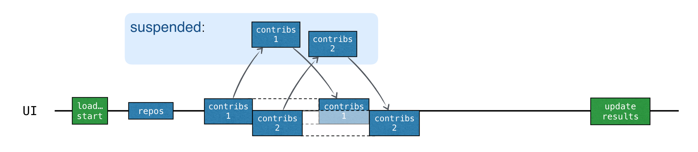

[](https://confluence.jetbrains.com/display/ALL/JetBrains+on+GitHub)
[](https://www.apache.org/licenses/LICENSE-2.0)

# Introduction to Coroutines and Channels Hands-On Lab

This repository is the code corresponding to the
[Introduction to Coroutines and Channels](https://play.kotlinlang.org/hands-on/Introduction%20to%20Coroutines%20and%20Channels/01_Introduction)
Hands-On Lab.

## [Concurrency](https://kotlinlang.org/docs/coroutines-and-channels.html#concurrency)

새로운 코루틴을 시작하기 위해 launch, async, runBlocking 등의 코루틴 빌더를 사용합니다. 이러한 빌더들은 각기 다른 라이브러리에서 추가적인 코루틴 빌더를 정의할 수 있습니다.

`async`는 새로운 코루틴을 시작하고 `Deferred`라는 객체를 반환합니다. `Deferred`는 `Future` 또는 `Promise` 등의 이름으로 알려진 개념을 나타냅니다. 이는 계산을 저장하지만, 최종
결과를 얻는 시점을 뒤로 미루며, 미래 어느 시점에 결과를 제공하겠다는 약속을 합니다.

`async`와 `launch`의 주요 차이점은, `launch`가 특정 결과를 반환할 것으로 기대되지 않는 계산을 시작하는 데 사용된다는 것입니다. `launch`는 코루틴을 대표하는 `Job`을
반환하고, `Job.join()`을 호출하여 완료될 때까지 기다릴 수 있습니다.

`Deferred`는 `Job`을 확장한 제네릭 타입입니다. `async` 호출은 람다가 반환하는 것에 따라 `Deferred<Int>` 또는 `Deferred<CustomType>`을 반환할 수 있습니다 (람다
내의 마지막 표현식이 결과입니다).

코루틴의 결과를 얻기 위해서는, `Deferred`인스턴스에서 `await()`를 호출할 수 있습니다. 결과를 기다리는 동안 이 `await()`가 호출된 코루틴은 일시 중지(suspended)됩니다.

`runBlokcing`은 일반 함수와 suspend 함수 또는 blocking과 non-blokcking 세계 사이의 다리 역할을 합니다. 이는 최상위 main 코루틴을 시작하는 적응기로 작동하며,
주로 `main()` 함수와 테스트에서 사용됩니다.

`Deferred` 객체의 리스트가 있을 경우, `awaitAll()`을 호출하여 모든 결과를 기다릴 수 있습니다.

```kotlin
import kotlinx.coroutines.*

fun main() = runBlocking {
    val deferreds: List<Deferred<Int>> = (1..3).map {
        async {
            delay(1000L * it)
            println("Loading $it")
            it
        }
    }
    val sum = deferreds.awaitAll().sum()
    println("$sum")
}
```

**동시에 여러 작업 처리**

: `async`를 사용하면 여러 작업을 동시에 실행하고, 각각의 작업이 완료될 때까지 기다릴 수 있습니다. 이는 작업을 하나씩 순차적으로 처리하는 것보다 더 빠른 성능을 낼 수 있습니다.

